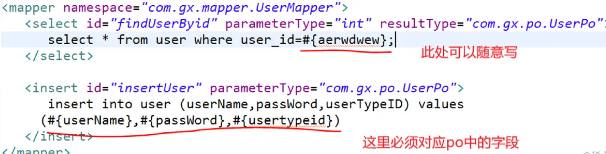

## MyBatis动态SQL

在mybatis中动态 sql 是其主要特性之一，在 mapper 中定义的参数传到 xml 中之后，在执行操作之前 mybatis 会对其进行动态解析。mybatis 提供了两种支持动态 sql 的语法：#{} 以及 ${}， **其最大的区别则是前者方式能够很大程度防止sql注入(安全)，后者方式无法防止Sql注入** 。

#### 关于#{}

1、#{}表示一个占位符号 相当于 `jdbc`中的 **?** 符号 #{}实现的是向prepareStatement中的预处理语句中设置参数值，sql语句中#{}表示一个占位符即?

2、#{}将传入的数据都当成一个字符串，会对自动传入的数据加一个双引号。如：`select * from user where id= #{user_id}`，如果传入的值是11,那么解析成sql时的值为 `where id="11"`

3、如果sql语句中只有`一个参数`,此时参数名称可以`随意定义` 如果sql语句有**多**个参数,此时参数名称应该是与当前表关联[实体类的属性名]或则[Map集合关键字]，**不能随便写，必须对应**！



#### 关于${}

1、将传入的数据直接显示生成在sql中。如`select * from user where id = {user_id}` ，如果传入的值是11，那么解析成SQL时的值为`where id = 11`

2、`${value}`中`value`值有限制只能写对应的value值不能随便写，因为`${}`不会自动进行jdbc类型转换

3、简单来说,在`JDBC`不支持使用占位符的地方,都可以使用`${}`

#### 区别

**#{}方式能够很大程度防止sql注入(安全)，${}方式无法防止Sql注入**

在`JDBC`能使用占位符的地方,最好优先使用 `#{}`

在`JDBC`不支持使用占位符的地方,就只能使用`${}`，典型情况就是 **动态参数**

例子：

1.有两张表，分别是emp_2017和emp_2018 . 如果需要在查询语句中 动态指定表名，就只能使用 `${}`

```sql
<select>
      select *  from emp_ ${year}
<select>
```

2.使用Mybatis排序时，使用order by动态参数时，此时也只能使用 `${}`

```sql
<select>
       select  *  from dept order by ${name}
</select>
```

3.使用like 进行模糊匹配

```sql
<select>
	select * from shop where keywords like '%${paramsMap.keywords}%'
</select>
```


解决：like 模糊匹配替代可使用mysql函数 CONCAT代替

```mysql
<select>
	select * from shop where keywords like CONCAT('%',#{paramsMap.keywords},'%')
</select>
```


Mybatis常用动态SQL格式使用

1. 多值匹配判断

   ```sql
   <select id="queryItemsBySpecIds" parameterType="List" resultType="com.imooc.vo.ShopCartVO"
   select item.id as itemId from items 
   where 
   items_img.is_main = 1 
   and 
   itemId in 
     <foreach collection="paramsList" index="index" item="specId" open="(" close=")" separator=",">
        #{specId}
     </foreach>
   </select>  
   ```

   对应Mybatis interface

   ```java
   List<ShopCartVO> queryItemsBySpecIds(@Param("paramsList") List<String> specIdsList);
   ```

   

2. 多条件判断  order排序

   ```sql
   <select id="searchItemsByThirdCat" parameterType="map" resultMap="searchItemsVO">
   select 
   	i.id as itemId
   where 
   	i.cat_id = #{paramsMap.catId}
   order by
           <choose>
               <!--使用多条件判断排序  单引号 转义 &quot; -->
               <!--nested exception is org.mybatis.spring.MyBatisSystemException: nested exception is org.apache.ibatis.exceptions.PersistenceException-->
               <when test="paramsMap.sort == &quot;c&quot; ">
                   i.sell_counts desc
               </when>
               <when test="paramsMap.sort == &quot;p&quot; ">
                   tempSpec.price_discount asc
               </when>
               <otherwise>
                   i.item_name asc
               </otherwise>
           </choose>
   <select>        
   ```

   对应Mybatis interface

   ```java
   List<SearchItemsVO> searchItemsByThirdCat(@Param("paramsMap") Map<String,Object> map);
   ```

   

3. if条件判断

   ```sql
   <select id="queryItemComments" parameterType="map" resultMap="itemCommentVO">
       SELECT
        ic.comment_level as commentLevel,
        ic.content as content,
        ic.sepc_name as specName,
        ic.created_time as createdTime,
        u.face as userFace,
        u.nickname as nickname
       FROM
        items_comments ic
       LEFT JOIN
        users u
       ON
        ic.user_id = u.id
       WHERE
        ic.item_id = #{paramsMap.itemId}
        <if test="paramsMap.level != null and paramsMap.level != '' ">
          AND ic.comment_level = #{paramsMap.level}
        </if>
     </select>
   ```

   对应Mybatis interface

   ```java
   List<ItemCommentVO> queryItemComments(@Param("paramsMap") Map<String,Object> map);
   ```

   