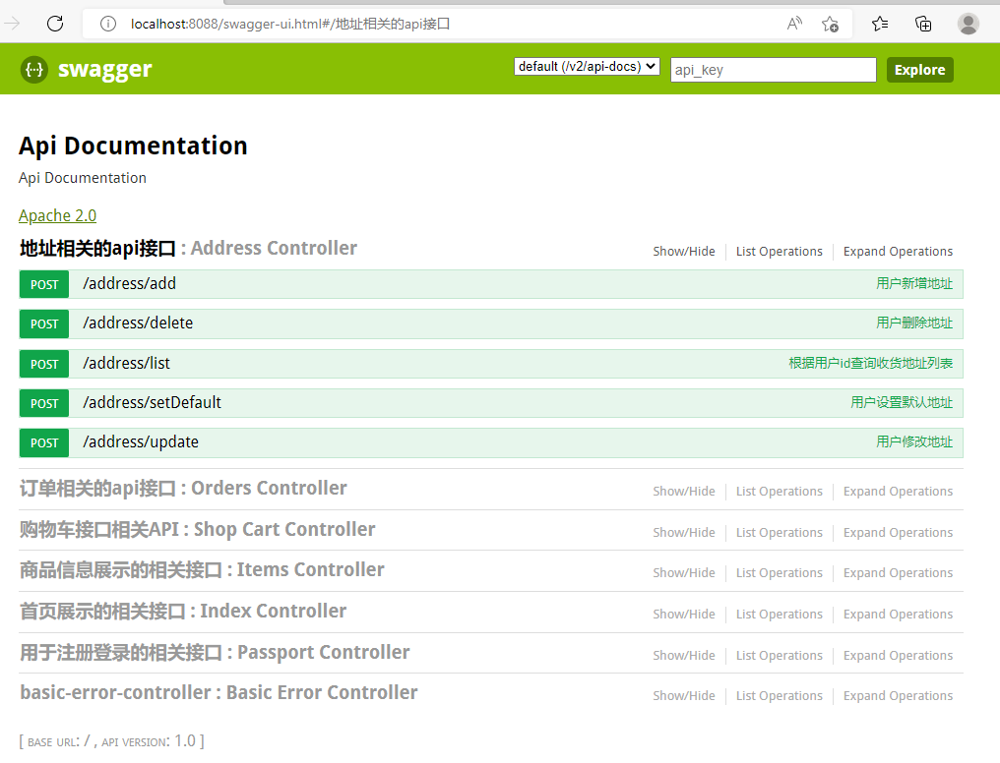
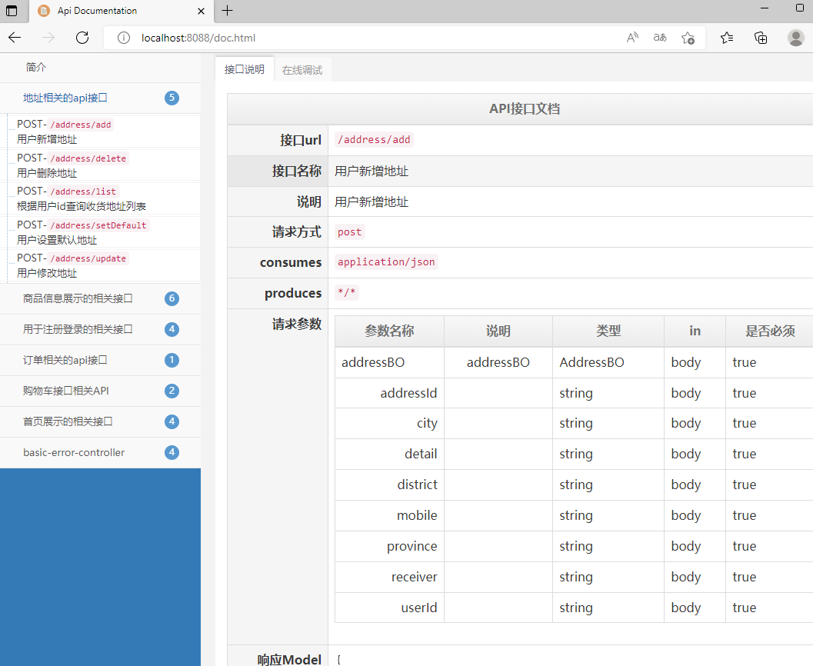

## Swagger2文档API

为了减少程序员撰写文档时间，提高生产力， Swagger2 应运而生，使用 Swagger2 可以减少编写过多的文档，只需要通过代码就能生成文档API,提供给前端人员

常方便。

引入依赖

```xml
<!-- swagger2 配置 -->
        <dependency>
            <groupId>io.springfox</groupId>
            <artifactId>springfox-swagger2</artifactId>
            <version>2.4.0</version>
        </dependency>
        <dependency>
            <groupId>io.springfox</groupId>
            <artifactId>springfox-swagger-ui</artifactId>
            <version>2.4.0</version>
        </dependency>
        <dependency>
            <groupId>com.github.xiaoymin</groupId>
            <artifactId>swagger-bootstrap-ui</artifactId>
            <version>1.6</version>
        </dependency>
```

使用规则

```java
package com.imooc.config;

import org.springframework.context.annotation.Configuration;
import springfox.documentation.builders.ApiInfoBuilder;
import springfox.documentation.builders.PathSelectors;
import springfox.documentation.builders.RequestHandlerSelectors;
import springfox.documentation.service.ApiInfo;
import springfox.documentation.service.Contact;
import springfox.documentation.spi.DocumentationType;
import springfox.documentation.spring.web.plugins.Docket;
import springfox.documentation.swagger2.annotations.EnableSwagger2;

@Configuration
@EnableSwagger2
public class Swagger2 {

    // http://localhost:8088/swagger-ui.html
    // http://localhost:8088/doc.html

    //配置swagger2核心配置 docket
    public Docket createRestApi(){
        return new Docket(DocumentationType.SWAGGER_2) //指定api类型为swagger2
                    .apiInfo(apiInfo())             //用于定义api文档汇总信息
                    .select()
                .apis(RequestHandlerSelectors
                        .basePackage("com.imooc.controller"))    //指定controller包
                .paths(PathSelectors.any())                     //所有controller
                .build();
    }

    private ApiInfo apiInfo(){
        return new ApiInfoBuilder()
                .title("天天吃货  电商平台接口api")         //文档页标题
                .contact(new Contact("imooc",
                        "https://www.imooc.com",
                        "abc@imooc.com"))         //联系人信息
                .description("专为天天吃货提供的api文档")   //详细信息
                .version("v1.0.1")    //文档版本号
                .termsOfServiceUrl("https://www.imooc.com")   //网站地址
                .build();
    }

}

```

文档显示内容配置通过注解

```java
import io.swagger.annotations.Api;
import io.swagger.annotations.ApiOperation;

// swagger2 接口说明
@Api(value = "注册登录",tags = {"用于注册登录的相关接口"})
@RestController
@RequestMapping("passport")
public class PassportController {
    @ApiOperation(value = "用户名是否存在", notes = "用户名是否存在", httpMethod = "GET")
    @Transactional(propagation = Propagation.SUPPORTS)
    @GetMapping("/usernameIsExist")
    public IMOOCJSONResult usernameIsExist(@RequestParam String username) {
        //...
    }
}
```

如果有不想显示的Controller API接口也可以通过添加注解不显示

```java
import springfox.documentation.annotations.ApiIgnore;
//忽略不在 swagger2中显示
@ApiIgnore
@RestController
public class HelloController {
	 @GetMapping("/hello")
    public Object hello(){
        logger.debug("debug: hello~");
        logger.info("info: hello~");
        logger.warn("warn: hello~");
        logger.error("error: hello~");
        return "Hello World~";
    }
}
```

也可以对传输的数据内容及参数进行文档说明

```java
//swagger2 请求对象的接口说明
@ApiModel(value = "用户对象BO",description = "从客户端，由用户传入的数据封装在此entity")
public class UserBO {

    //swagger2 请求对象属性的说明
    @ApiModelProperty(value = "用户名",name = "username",example = "imooc",required = true)
    private String username;
    @ApiModelProperty(value = "密码",name = "password",example = "123456",required = true)
    private String password;
    @ApiModelProperty(value = "确认密码",name = "confirmPassword",example = "123456",required = true)
    private String confirmPassword;
}
```

文档效果，访问路径localhost:8088/swagger-ui.html



使用带有bootstrap的效果，访问路径localhost:8088/doc.html

